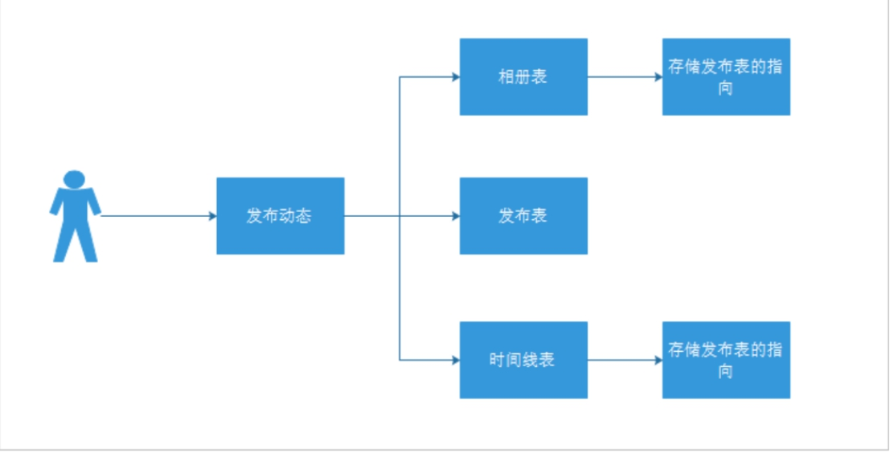
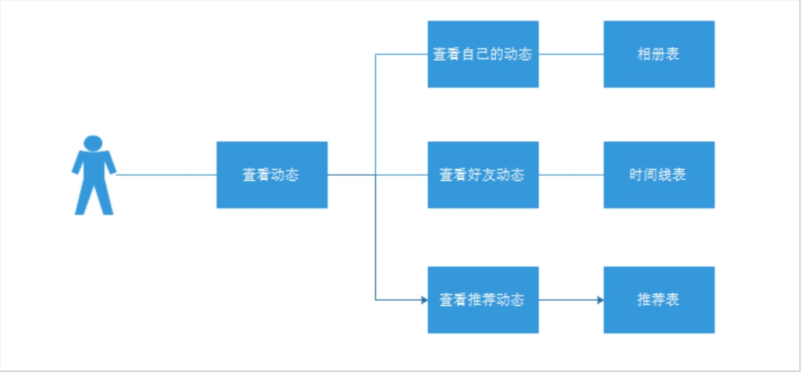

### 技术点

### 1、WebMagic

#### 1.1 WebMagic是什么？

webmagic是一个开源的Java垂直爬虫框架，目标是简化爬虫的开发流程，让开发者专注于逻辑功能的开发。webmagic的核心非常简单，但是覆盖爬虫的整个流程，也是很好的学习爬虫开发的材料。

#### 1.2 WebMagic特色

完全模块化的设计，强大的可扩展性。

核心简单但是涵盖爬虫的全部流程，灵活而强大，也是学习爬虫入门的好材料。

提供丰富的抽取页面API。

无配置，但是可通过POJO+注解形式实现一个爬虫。

支持多线程。

支持分布式。

支持爬取js动态渲染的页面。

无框架依赖，可以灵活的嵌入到项目中去。

### 2、Kafka

#### 2.1 Kafka 是什么?

Kafka 是一款分布式流处理框架，用于实时构建流处理应用。它有一个核心 的功能广为人知，即作为企业级的消息引擎被广泛使用。

 

你一定要先明确它的流处理框架地位，这样能给面试官留 下一个很专业的印象。

#### 2.2 Kafka 的特点？

高吞吐量、低延迟：kafka每秒可以处理几十万条消息，它的延迟最低只有几毫秒

可扩展性：kafka集群支持热扩展

持久性、可靠性：消息被持久化到本地磁盘，并且支持数据备份防止数据丢失

容错性：允许集群中节点失败（若副本数量为n,则允许n-1个节点失败）

高并发：支持数千个客户端同时读写

#### 2.3 什么是消费者组?

消费者组是 Kafka 独有的概念，如果面试官问这 个，就说明他对此是有一定了解的。我先给出标准答案：
1、定义：即消费者组是 Kafka 提供的可扩展且具有容错性的消费者机制。
2、原理：在 Kafka 中，消费者组是一个由多个消费者实例 构成的组。多个实例共同订阅若干个主题，实现共同消费。同一个组下的每个实例都配置有 相同的组 ID，被分配不同的订阅分区。当某个实例挂掉的时候，其他实例会自动地承担起 它负责消费的分区。

此时，又有一个小技巧给到你:消费者组的题目，能够帮你在某种程度上掌控下面的面试方向。

如果你擅长位移值原理，就不妨再提一下**消费者组的位移提交机制**;

如果你擅长 Kafka Broker，可以提一下**消费者组与 Broker 之间的交互**;

如果你擅长与消费者组完全不相关的 Producer，那么就可以这么说:“**消费者组要消 费的数据完全来自于 Producer 端生产的消息，我对 Producer 还是比较熟悉的。**”

#### 2.4 Kafka 中，ZooKeeper 的作用是什么?

这是一道能够帮助你脱颖而出的题目。碰到这个题目，请在心中暗笑三声。

目前，Kafka 使用 ZooKeeper 存放集群元数据、成员管理、Controller 选举，以及其他一些管理类任务。之后，等 KIP-500 提案完成后，Kafka 将完全不再依赖 于 ZooKeeper。

记住，一定要突出“目前”，以彰显你非常了解社区的演进计划。“存放元数据”是指主题 分区的所有数据都保存在 ZooKeeper 中，且以它保存的数据为权威，其他“人”都要与它 保持对齐。“成员管理”是指 Broker 节点的注册、注销以及属性变更，等 等。“Controller 选举”是指选举集群 Controller，而其他管理类任务包括但不限于主题 删除、参数配置等。

不过，抛出 KIP-500 也可能是个双刃剑。碰到非常资深的面试官，他可能会进一步追问你 KIP-500 是做的。一言以蔽之:KIP-500 思想，是使用社区自研的基于 Raft 的共识算法， 替代 ZooKeeper，实现 Controller 自选举。

#### 2.5如何估算 Kafka 集群的机器数量?

这道题目考查的是机器数量和所用资源之间的关联关系。所谓资源，也就是 CPU、内存、磁盘和带宽。

通常来说，CPU 和内存资源的充足是比较容易保证的，因此，你需要从磁盘空间和带宽占用两个维度去评估机器数量。

在预估磁盘的占用时，你一定不要忘记计算副本同步的开销。如果一条消息占用 1KB 的磁 盘空间，那么，在有 3 个副本的主题中，你就需要 3KB 的总空间来保存这条消息。显式地 将这些考虑因素答出来，能够彰显你考虑问题的全面性，是一个难得的加分项。

对于评估带宽来说，常见的带宽有 1Gbps 和 10Gbps，但你要切记，这两个数字仅仅是最大值。因此，你最好和面试官确认一下给定的带宽是多少。然后，明确阐述出当带宽占用接 近总带宽的 90% 时，丢包情形就会发生。这样能显示出你的网络基本功。

#### 2.6 Kafka 为什么不支持读写分离?

这道题目考察的是你对 Leader/Follower 模型的思考。

Leader/Follower 模型并没有规定 Follower 副本不可以对外提供读服务。很多框架都是允 许这么做的，只是 Kafka 最初为了避免不一致性的问题，而采用了让 Leader 统一提供服 务的方式。

不过，在开始回答这道题时，你可以率先亮出观点:**自 Kafka 2.4 之后，Kafka 提供了有限度的读写分离，也就是说，Follower 副本能够对外提供读服务。**

说完这些之后，你可以再给出之前的版本不支持读写分离的理由。

**场景不适用**读写分离适用于那种读负载很大，而写操作相对不频繁的场景，可 Kafka 不属于这样的场景。

**同步机制**Kafka 采用 PULL 方式实现 Follower 的同步，因此，Follower 与 Leader 存 在不一致性窗口。如果允许读 Follower 副本，就势必要处理消息滞后(Lagging)的问题。

 

### 3、MyCat

#### 3.1 mycat是什么？

一个新颖的数据库中间件产品，支持事务、ACID、可以替代MySQL的加强版数据库，结合传统数据库和新型分布式数据仓库的新一代企业级数据库产品，一个可以视为MySQL集群的企业级数据库，用来替代昂贵的Oracle集群。

#### 3.2 mycat是用什么语言编写的？

MyCat 是目前最流行的基于 java 语言编写的数据库中间件，是一个实现了 MySQL 协议的服务器。

#### 3.3垂直切分和水平切分的不同？

垂直切分：按照不同的表（或者Schema）来切分到不同的数据库（主机）之上

优点：

拆分后业务清晰，拆分规则明确。

系统之间整合或扩展容易。

数据维护简单。

缺点：

部分业务表无法join，只能通过接口方式解决，提高了系统复杂度。

受每种业务不同的限制存在单库性能瓶颈，不易数据扩展跟性能提高。

事务处理复杂。

由于垂直切分是按照业务的分类将表分散到不同的库，所以有些业务表会过于庞大，存在单库读写与存储瓶颈，所以就需要水平拆分来做解决。

水平切分：根据表中的数据的逻辑关系，将同一个表中的数据按照某种条件拆分到多台数据库（主机）上面。

优点：

拆分规则抽象好，join操作基本可以数据库做。

不存在单库大数据，高并发的性能瓶颈。

应用端改造较少。

提高了系统的稳定性跟负载能力。

缺点：

拆分规则难以抽象。

分片事务一致性难以解决。

数据多次扩展难度跟维护量极大。

跨库join性能较差。

#### 4.什么叫混合切分？

项目组中如果有水平切分，那项目组里的开发方式就叫混合切分。或者项目组里就是单纯的垂直切分。

#### 3.4 逻辑库，逻辑表，数据节点，节点主机分别代表的含义？

逻辑库：逻辑库不是真实存在的，它是通过真实的库映射出来！回答:数据库集群对外的统一访问入口。

逻辑表：既然有逻辑库，那么就会有逻辑表，分布式数据库中，对应用来说，读写数据的表就是逻辑表。逻辑表，可以是数据切分后，分布在一个或多个分片库中，也可以不做数据切分，不分片，只有一个表构成。

**分片节点：**

数据切分后，一个大表被分到不同的分片数据库上面，每个表分片所在的数据库就是分片节点(dataNode)。

**节点主机：**

数据切分后，每个分片节点不一定会独占一台机器，同一机器上面可以有多个分片，这样一个或多个分片节点所在的机器就是节点主机，为了避免单节点主机并发数限制，尽量将读写压力高的分片节点均衡放置在不同的节点主机。

**E-R表：**

关系型数据库是基于实体关系模型之上，通过其描述了真实世界中事物与关系，Mycat中的ER表即是来源于此。根据这一思路，提出了基于E-R关系的数据分片策略，子表的记录与所关联的父表记录存放在同一个数据分片上，即子表依赖父表，通过表分组保证数据join不会跨库操作。

表分组（Table Group）是解决跨分片数据join的一种很好的思路，也是数据切分规划的重要一规则。

### 4、Habse

#### 4.1 Hbase是什么？

 

Hbase一个分布式的基于列式存储的数据库,基于Hadoop的hdfs存储，zookeeper进行管理。

Hbase适合存储半结构化或非结构化数据，对于数据结构字段不够确定或者杂乱无章很难按一个概念去抽取的数据。

Hbase为null的记录不会被存储.

基于的表包含rowkey，时间戳，和列族。新写入数据时，时间戳更新，同时可以查询到以前的版本.

hbase是主从架构。hmaster作为主节点，hregionserver作为从节点。

#### 4.2 HBase 的特点是什么？

**大：**一个表可以有数十亿行，上百万列；

**无模式：**每行都有一个可排序的主键和任意多的列，列可以根据需要动态的增加，同一张表中不同的行可以有截然不同的列；

**面向列：**面向列（族）的存储和权限控制，列（族）独立检索；

**稀疏：**空（null）列并不占用存储空间，表可以设计的非常稀疏；

**数据多版本：**每个单元中的数据可以有多个版本，默认情况下版本号自动分配，是单元格插入时的时间戳；

***数据类型单一：**Hbase 中的数据都是字符串，没有类型。

#### 4.3 HBase 适用于怎样的情景？

半结构化或非结构化数据、记录非常稀疏、多版本数据、超大数据量，以上情况适用于HBase 。

#### 4.4 描述 HBase 的 rowKey 的设计原则？

 

Rowkey 长度原则

Rowkey 是一个二进制码流，Rowkey 的长度被很多开发者建议说设计在 10~100 个字节，不过建议是越短越好，不要超过 16 个字节。

原因如下：

（1）数据的持久化文件 HFile 中是按照 KeyValue 存储的，如果 Rowkey 过长比如 100个字节，1000 万列数据光 Rowkey 就要占用 100*1000 万=10 亿个字节，将近 1G 数据，这会极大影响 HFile 的存储效率；

（2）MemStore 将缓存部分数据到内存，如果 Rowkey 字段过长内存的有效利用率会降低，系统将无法缓存更多的数据，这会降低检索效率。因此 Rowkey 的字节长度越短越好。

（3）目前操作系统是都是 64 位系统，内存 8 字节对齐。控制在 16 个字节，8 字节的整数倍利用操作系统的最佳特性。

 

Rowkey 散列原则

如果Rowkey 是按时间戳的方式递增，不要将时间放在二进制码的前面，建议将Rowkey的高位作为散列字段，由程序循环生成，低位放时间字段，这样将提高数据均衡分布在每个Regionserver 实现负载均衡的几率。如果没有散列字段，首字段直接是时间信息将产生所有新数据都在一个 RegionServer 上堆积的热点现象，这样在做数据检索的时候负载将会集中在个别 RegionServer，降低查询效率。

Rowkey 唯一原则

必须在设计上保证其唯一性。 

#### 4.5 描述 HBase 中 scan 和 get 的功能以及实现的异同？

 

HBase 的查询实现只提供两种方式：

（1）按指定 RowKey 获取唯一一条记录，get 方法（org.apache.hadoop.hbase.client.Get）Get 的方法处理分两种 : 设置了 ClosestRowBefore 和没有设置 ClosestRowBefore 的rowlock。主要是用来保证行的事务性，即每个 get 是以一个 row 来标记的。一个 row 中可以有很多 family 和 column。

（2）按指定的条件获取一批记录，scan 方法(org.apache.Hadoop.hbase.client.Scan）实现条件查询功能使用的就是 scan 方式。

 

#### 4.6 请详细描述 HBase 中一个 cell 的结构？

HBase 中通过 row 和 columns 确定的为一个存贮单元称为 cell。

Cell：由{row key, column(=<family> + <label>), version}唯一确定的单元。cell 中的数据是没有类型的，全部是字节码形式存贮。 

#### 4.7 简述 HBase 中 compact 用途是什么，什么时候触发，分为哪两种，有什么区别，有哪些相关配置参数？

在 hbase 中每当有 memstore 数据 flush 到磁盘之后，就形成一个 storefile，当 storeFile的数量达到一定程度后，就需要将 storefile 文件来进行 compaction 操作。

Compact 的作用：

① 合并文件

② 清除过期，多余版本的数据

③ 提高读写数据的效率

HBase 中实现了两种 compaction 的方式：minor and major. 这两种 compaction 方式的

区别：

1、Minor 操作只用来做部分文件的合并操作以及包括 minVersion=0 并且设置 ttl 的过期版本清理，不做任何删除数据、多版本数据的清理工作。

2、Major 操作是对 Region 下的 HStore 下的所有 StoreFile 执行合并操作，最终的结果是整理合并出一个文件。 

#### 4.8 HBase 优化？

（1）高可用

在 HBase 中 Hmaster 负责监控 RegionServer 的生命周期，均衡 RegionServer 的负载，如果 Hmaster 挂掉了，那么整个 HBase 集群将陷入不健康的状态，并且此时的工作状态并不会维持太久。所以 HBase 支持对 Hmaster 的高可用配置。 

（2）预分区

每一个 region 维护着 startRow 与 endRowKey，如果加入的数据符合某个 region 维护的rowKey 范围，则该数据交给这个 region 维护。那么依照这个原则，我们可以将数据所要投放的分区提前大致的规划好，以提高 HBase 性能 .

 

（3）RowKey 设计

一条数据的唯一标识就是 rowkey，那么这条数据存储于哪个分区，取决于 rowkey 处于哪个一个预分区的区间内，设计 rowkey 的主要目的 ，就是让数据均匀的分布于所有的 region中，在一定程度上防止数据倾斜。接下来我们就谈一谈 rowkey 常用的设计方案 

 

（4）7.4 内存优化

HBase 操作过程中需要大量的内存开销，毕竟 Table 是可以缓存在内存中的，一般会分配整个可用内存的 70%给 HBase 的 Java 堆。但是不建议分配非常大的堆内存，因为 GC 过程持续太久会导致 RegionServer 处于长期不可用状态，一般 16~48G 内存就可以了，如果因为框架占用内存过高导致系统内存不足，框架一样会被系统服务拖死。

#### 4.9 HBase 读写流程？

读：

（1）HRegionServer 保存着 meta 表以及表数据，要访问表数据，首先 Client 先去访问zookeeper，从 zookeeper 里面获取 meta 表所在的位置信息，即找到这个 meta 表在哪个HRegionServer 上保存着。

（2）接着 Client 通过刚才获取到的 HRegionServer 的 IP 来访问 Meta 表所在的HRegionServer，从而读取到 Meta，进而获取到 Meta 表中存放的元数据。

（3）Client 通过元数据中存储的信息，访问对应的 HRegionServer，然后扫描所在HRegionServer 的 Memstore 和 Storefile 来查询数据。

（4）最后 HRegionServer 把查询到的数据响应给 Client。

 

 

写：

（1）Client 先访问 zookeeper，找到 Meta 表，并获取 Meta 表元数据。

（2）确定当前将要写入的数据所对应的 HRegion 和 HRegionServer 服务器。

（3）Client 向该 HRegionServer 服务器发起写入数据请求，然后 HRegionServer 收到请求并响应。 

（4）Client 先把数据写入到 HLog，以防止数据丢失。

（5）然后将数据写入到 Memstore。

（6）如果 HLog 和 Memstore 均写入成功，则这条数据写入成功。

（7）如果 Memstore 达到阈值，会把 Memstore 中的数据 flush 到 Storefile 中。

（8）当 Storefile 越来越多，会触发 Compact 合并操作，把过多的 Storefile 合并成一个大的 Storefile。

（9）当 Storefile 越来越大，Region 也会越来越大，达到阈值后，会触发 Split 操作，将Region 一分为二。

#### 4.10 HBase 内部机制是什么？

 

Hbase 是一个能适应联机业务的数据库系统物理存储：hbase 的持久化数据是将数据存储在 HDFS 上。

（1）存储管理：一个表是划分为很多 region 的，这些 region 分布式地存放在很多 regionserver上 Region 内部还可以划分为 store，store 内部有 memstore 和 storefile。

（2）版本管理：hbase 中的数据更新本质上是不断追加新的版本，通过 compact 操作来做版本间的文件合并 Region 的 split。

（3）集群管理：ZooKeeper + HMaster + HRegionServer。

 

#### 4.11 如何提高 HBase 客户端的读写性能？请举例说明

（1）开启 bloomfilter 过滤器，开启 bloomfilter 比没开启要快 3、4 倍。

（2）Hbase 对于内存有特别的需求，在硬件允许的情况下配足够多的内存给它。

（3）通过修改 hbase-env.sh 中的export HBASE_HEAPSIZE=3000 #这里默认为 1000m

（4）增大 RPC 数量，通过修改 hbase-site.xml 中的 hbase.regionserver.handler.count 属性，可以适当的放大RPC 数量，默认值为 10 有点小。 

### 5、Spark

#### 5.1 Spark是什么？

是一种用于大规模数据处理的快速计算引擎。Spark 是一种与 Hadoop 相似的开源集群计算环境，Spark 启用了内存分布数据集，除了能够提供交互式查询外，它还可以优化迭代工作负载。

#### 5.2 Spark的特点？

首先，高级 API 剥离了对集群本身的关注，Spark 应用开发者可以专注于应用所要做的计算本身。

其次，Spark 很快，支持交互式计算和复杂算法。内存计算下，Spark 比 Hadoop 快100倍。

最后，Spark 是一个通用引擎，可用它来完成各种各样的运算，包括 SQL 查询、文本处理、机器学习等，而在 Spark 出现之前，我们一般需要学习各种各样的引擎来分别处理这些需求。

### 6、Hive（数据仓库工具）

#### 6.1 Hive是什么？

Hive用来进行数据提取、转化、加载，这是一种可以存储、查询和分析存储在Hadoop中的大规模数据的机制，hive数据仓库工具能将结构化的数据文件映射为一张数据库表，并提供SQL查询功能，能将SQL语句转变成MapReduce任务来执行。

#### 6.2 Hive的优点？

Hive的优点是学习成本低，可以通过类似SQL语句实现快速MapReduce统计，使MapReduce变得更加简单，而不必开发专门的MapReduce应用程序。hive十分适合对数据仓库进行统计分析。

 

#### 6.3 Hive适用的场景？

总的来说，Hive是十分适合数据仓库的统计分析和Windows注册表文件。

Hive在Hadoop中扮演数据仓库的角色。Hive添加数据的结构在HDFS(Hive superimposes structure on data in HDFS)，并允许使用类似于SQL语法进行数据查询。

Hive更适合于数据仓库的任务，主要用于静态的结构以及需要经常分析的工作。Hive与SQL相似促使其成为Hadoop与其他BI工具结合的理想交集。

 

 

###### **2.6.3.1 通过页面分析，剖析如下：**

1、推荐频道为根据问卷及喜好推荐相似用户动态(**RocketMQ+Spark + MLlib**)

2、显示内容为用户头像、用户昵称、用户性别、用户年龄、用户标签和用户发布动态

3、图片最多不超过6张或发布一个小视频(**FastDFS**)

4、动态下方显示发布时间距离当时时间，例如10分钟前、3小时前、2天前，显示时间进行取整。(**MongoDB Geo**)

5、动态下方显示距离为发布动态地与本地距离

6、显示用户浏览量

7、显示点赞数、评论数 转发数

 

 

 

###### **2.6.3.2 发布流程：**

 

\- 用户发布动态，首先将动态内容写入到发布表。

\- 然后，将发布的指向写入到自己的相册表中。

\- 最后，将发布的指向写入到好友的时间线中。

###### **2.6.3.3 查看流程：**

 

\- 用户查看动态，如果查看自己的动态，直接查询相册表即可

\- 如果查看好友动态，查询时间线表即可

\- 如果查看推荐动态，查看推荐表即可

由此可见，查看动态的成本较低，可以快速的查询到动态数据。

###### **2.6.3.4 实现话术：**

我负责项目中的圈子功能的实现，类似微信的朋友圈，基本的功能为：发布动态、浏览好友动态、浏览推荐动态、点赞、评论、喜欢等功能。我们这里采用spark + mllib实现智能推荐，这样的话就会根据我们自身的条件，喜好进行匹配推送用户感兴趣的动态。针对用户上传的动态我们采用rocketMQ发送消息调用华为云内容审核进行自动处理，考虑到需要处理海量的动态信息数据，我们这里选用了MongoDB+Redis的形式来进行数据的存储，其中MongoDB负责存储，Redis负责缓存。

首先是查询好友动态接口的实现，用户点击好友动态之后，服务器会从ThreadLocal中获取用户id，根据用户id从该用户对应的好友动态时间线表中查询出所有好友动态id以及对应的好友id，再根据动态id从总动态表查询动态详细信息，根据动态发布的时间倒序排序。再根据好友id从用户详情表中查询好友用户详细信息，再将这些信息构造成vo对象返回给前端进行分页展示。

接下来说一下用户发布动态接口的实现，用户在客户端写好文本，上传好图片，确定好位置点击发布按钮之后，请求会携带一系列参数，文本内容，图片文件，地理位置的经纬度等，后端代码先创建对象，设置相应的属性，保存到MongoDB动态表中，此时动态的状态属性默认设置为0，表示待审核。然后通过rocketMQ向消息中间件发送一条消息，包含动态id，消息消费者接收到消息之后会调用华为云的内容审核服务，对文字信息和图片信息进行审核，审核通过后将动态的状态属性改为1，表示已通过，不然就改为2，表示驳回。然后前端在展示动态的时候只会查询状态为已通过的动态。动态发布成功之后也会像消息中间件发送消息，消息内容包括动态id（objectId类型）、用户id、操作类型、Long类型的pid。消息消费者会以此生成一条该用户对该动态的一个评分记录保存到MongoDB的动态评分表中，作为大数据推荐的依据。

然后说一下用户对动态的一系列操作的接口的实现。我们是将用户的点赞、评论、喜欢操作记录到MongoDB的一个comment表中，用type字段来区分具体的操作类型，比如1代表点赞，2代表评论，3代表喜欢。用户进行操作之后服务器就会生成相应操作类型的comment记录保存到MongoDB的comment表中。保存成功后向消息中间件发送消息，消息内容包括动态id（objectId类型）、用户id、操作类型、Long类型的pid。消息消费者会以此生成一条该用户对该动态的一个评分记录保存到MongoDB的动态评分表中，作为大数据推荐的依据。

最后是推荐频道的动态展示接口的实现，服务器使用Spark + Mllib技术，根据用户的动态评分表，基于用户userCF算法进行推荐，将推荐的结果以pid组成的字符串形式存入Redis。用户进入推荐频道之后，服务器去查找Redis有没有推荐结果，如果没有的话，就从MongoDB中查询默认的推荐动态数据展示，如果有推荐结果，就获取字符串，转换成pid的数组，再根据这些pid从MongoDB的总动态表中查找对应动态信息，构造vo对象的分页结果，返回给前端展示给用户。

 

 

 

 