# 探花交友

### 一、项目介绍

探花交友是一个陌生人在线交友平台，在该平台中可以搜索附近的人，查看好友动态，平台提供大数据分析，通过后台推荐系统帮我们快速匹配自己的“意中人”。项目主要分为交友，圈子，消息，视频，我的五大块。项目的亮点是使用MongoDB 技术实现海量数据的存储；使用FastDFS实现图片的上传和下载；使用百度AI技术实现非人脸无法上传。项目采用前后端分离的方式开发，采用的是YApi在线文档进行数据交互管理。

#### 1.1 开发技术

前端：

\- flutter + android + 环信SDK + redux + shared_preferences + connectivity + iconfont + webview + sqflite

后端：

\- Spring Boot + SpringMVC + Mybatis + MybatisPlus + Dubbo

\- MongoDB geo 实现地理位置查询

\- MongoDB 实现海量数据的存储

\- Redis 数据的缓存

\- Spark + MLlib 实现智能推荐

\- 第三方服务 环信即时通讯 

\- 第三方服务 阿里云 OSS 、 短信服务

#### 1.2 技术架构

   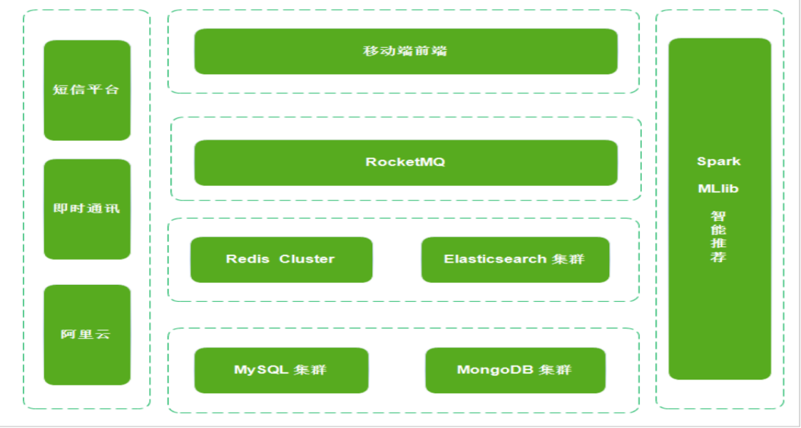

#### 1.3 开发方式

探花交友项目采用前后端分离的方式开发，就是前端由前端团队负责开发，后端负责接口的开发，这种开发方式有2点好处：

扬长避短，每个团队做自己擅长的事情

前后端可以并行开发，事先约定好接口地址以及各种参数、响应数据结构等。

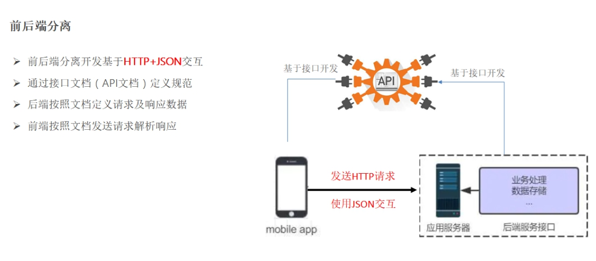 

我们在项目中使用YApi 在线接口文档来进行项目开发。YApi是一个开源的接口定义、管理、提供mock数据的管理平台。具体操作如下：

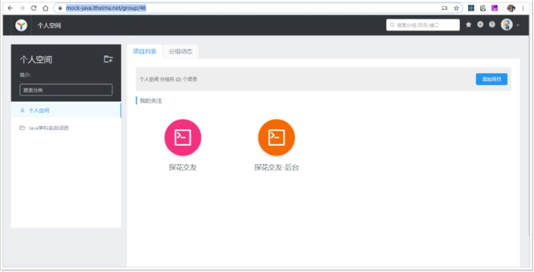 

接口定义：

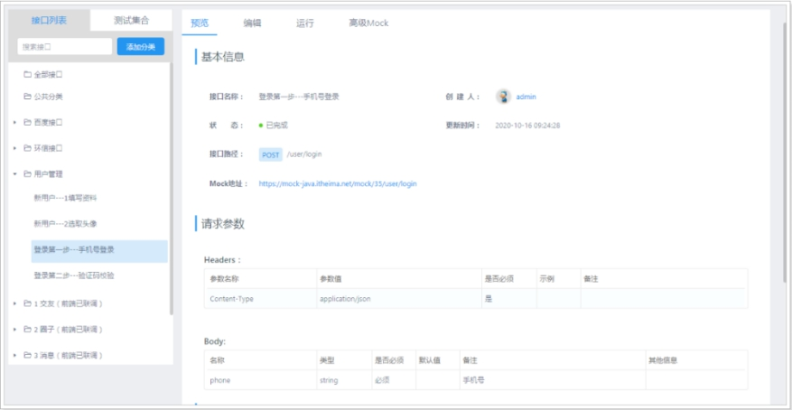 

 

### 二、功能介绍

探花交友平台，涵盖了主流常用的一些功能，如：交友、聊天、动态等。具体功能如列表所述：

####  功能列表

| 功能       | 说明                                           | 备注                                           |
| ---------- | ---------------------------------------------- | ---------------------------------------------- |
| 注册、登录 | 用户无需单独注册，直接通过手机号登录即可       | 首次登录成功后需要完善个人信息                 |
| 交友       | 主要功能有：测灵魂、桃花传音、搜附近、探花等   | 通过不同的趣味模式让我们找到自己更熟悉的人     |
| 圈子       | 类似微信朋友圈，用户可以发动态、查看好友动态等 |                                                |
| 消息       | 通知类消息 + 即时通讯消息                      |                                                |
| 小视频     | 类似抖音，用户可以发小视频，评论等             | 显示小视频列表需要进行推荐算法计算后进行展现。 |
| 我的       | 我的动态、关注数、粉丝数、通用设置等           |                                                |

 

#### 2.1 注册登录

用户通过手机验证码进行登录，如果是第一次登录则需要完善个人信息，在上传图片时，需要对上传的图片做人像的校验，防止用户上传非人像的图片作为头像。流程完成后，则登录成功。

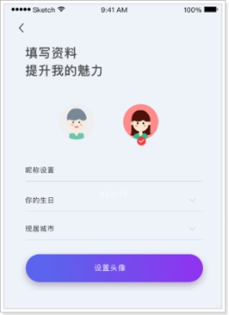

##### 2.1.1 技术要点：

**阿里大于 + Redis + JWT + OSS云存储 + 百度AI**

___

##### 2.1.2 涉及的表：

| tb_user（用户表）         |
| ------------------------- |
| tb_info（用户详细信息表） |

___

##### 2.1.3 实现分析：

实现用户登录我们要处理四个接口来进行实现，分别是：

**发送手机验证码(阿里大于)***

 \- 阿里云平台短信发送

**校验用户登录(Redis)**

 \- 后台需要验证手机号与验证码是否正确

 \- 校验成功之后，需要按照JWT规范进行返回响应

**首次登录完善个人信息(百度AI + OSS)**

**校验token是否有效(Redis + JWT)**

 \- 校验存储到Redis中的token是否有效

###### 2.1.3.1 发送手机验证码流程：

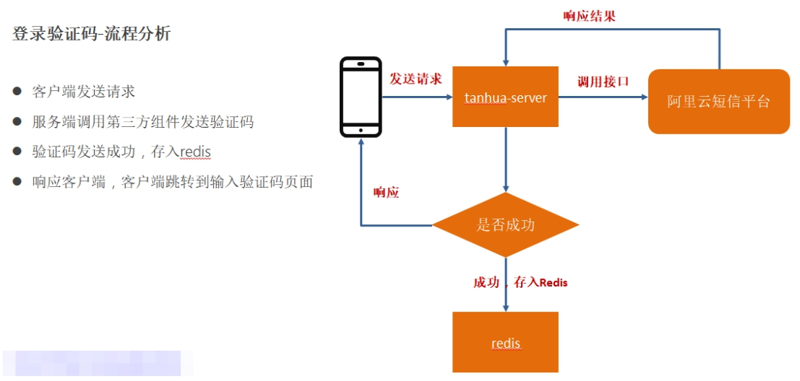 

用户在客户端输入手机号，点击发送验证码，向后台tanhua-server进行请求，调用后台阿里云短信平台进行短信发送。tanhua-server服务会会携带用户给发过来的两个参数(用户的手机号和后台生成的随机6位数)通过调用阿里大于第三方平台进行接口的响应。如果阿里云短信平台在接受响应成功后,会把验证码发送给客户，并把这个验证码保存到Redis中，并给这个验证码设置有效期为5分钟。

___

###### 2.1.3.2校验用户登录流程:

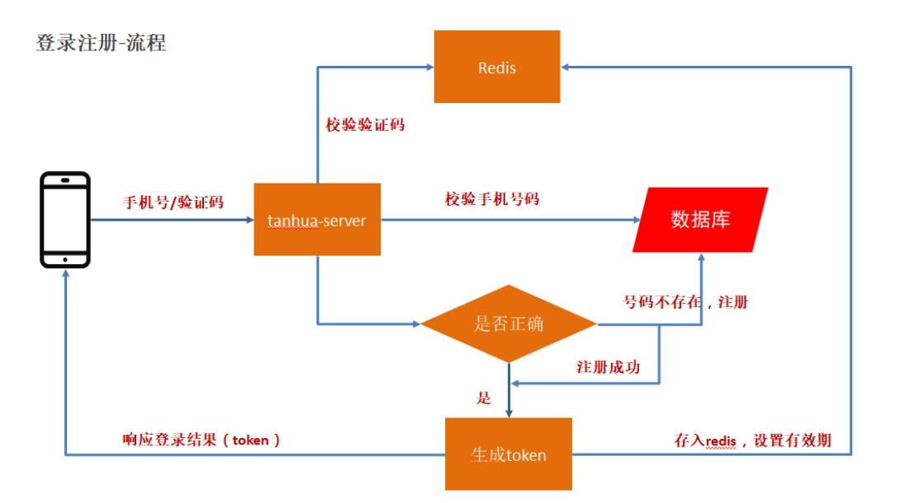 

当用户在手机上接受到验证码之后，开始输入验证码校验。当用户输入完6位验证码之后，会自动触发后台tanhua-server服务进行校验功能。对用户传输过来的手机号和验证码进行验证。如果校验通过会根据客户的手机号生成一个token，给客户返回一份，方便用户在App上访问其他微服务的时候进行身份的识别。同时在通过RocketMQ响应给JWT的鉴权中心通知其他微服务。在用户通过校验之后，我们会做3个工作：

1. 我们会根据用户的手机号给用户创建一个账户并存入mysql的用户表中。

2. 我们会调用RocketMQtemplate发送一条消息给消息中间件，用来给后台做log日志的统计，便于后台管理系统展示平台用户日活量，注册量等等。

3. 把创建的新用户id注册到环信通讯中，来实现即时通信的功能。

___

###### 2.1.3.3用户登录

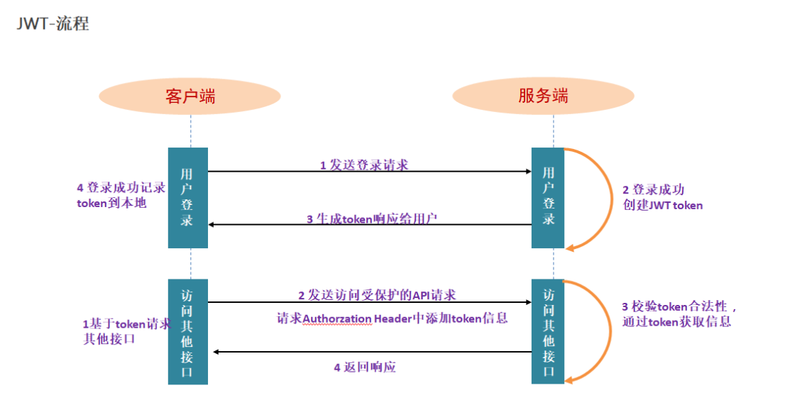

考虑到我们项目采用的是前后端分离架构，我们采用JWT生成token的方式来给用户进行身份识别，当我们登录成功后我们会根据用户的id和手机号生成一个token返回给用户并保存到Redis中。这样用户在访问受保护的资源的时候，我们会在后台进行校验客户端发过来的token，如果校验通过则进行放行。

在这块我们考虑到三个问题：

**1.是token续签；2. token的安全性； 3. 如何统一处理token；**

在解决token续签的问题上，我们这里采取的是在请求头获取token时判断token是否存在，如果不存在就创建token并保存到Redis中，如果存在我们就重新从Redis中获取token并进行续签(Duration.ofHours(1))。在安全问题上，我们这里采用加密加盐(SignatureAlgorithm.HS256,secret)的方式来解决。为了实现token统一校验，我们这里采用的是springmvc拦截机制+Threadlocal局部线程的方式来解决。这里我们自定义了一个TokenInterceptor拦截器，实现preHandle() 方法，这样的话就可以在用户请求进入controller层之前进行拦截，通过token获取了用户对象，并将用户对象存储到Threadlocal中，这样就实现了token统一校验的功能。具体的实现过程如下图：

___

###### 2.1.3.4首次登录完善个人信息

用户在完成登录操作之后，如果是第一次登录，用户会跳到完善个人信息页面，这块我们需要输入用户昵称，生日，所在地，设置头像。其中，头像数据需要做图片上传，这里采用阿里云的OSS服务作为我们的图片存储服务器。并且对头像要做人脸识别，非人脸照片不得上传，这里我们调用的是百度AI的人脸识别接口进行校验。我们需要在本地创建一个ossTemplate模板和aipFaceTemplate模板，把百度AI和阿里OSS给我们提供的SDK进行修改。我会在yml中创建以上两个模板所需要的参数。

 
         

#### 2.2 通用功能的实现

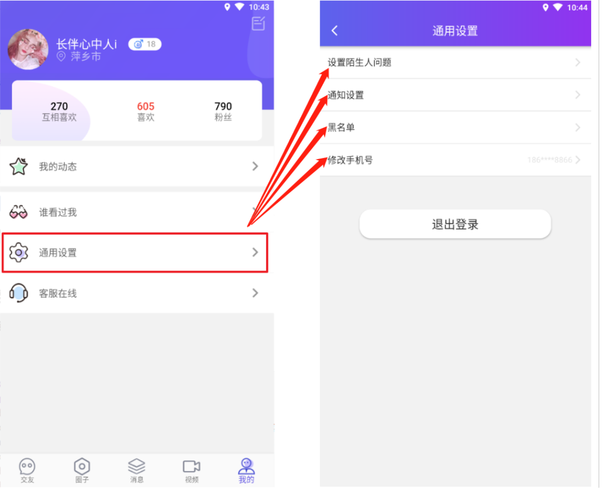

##### 2.2.1 涉及的表：

| tb_settings（通用设置）     |
| --------------------------- |
| tb_question（陌生人问题表） |
| tb_black_list（黑名单）     |

___

##### 2.2.2 实现分析

通用设置，包含探花交友APP基本的软件设置功能。主要功能有设置陌生人问题，通用设置，黑名单等。设置陌生人问题这块主要为了在添加你的时候需要回答问题，根据用户回答的问题，进行确认关系。我们这块主要做问题的添加和问题查看。这块就是根据用户的id查询用户的问题，问题查看就是如果没有问题那么就设置问题，如果有就update重新更新一下。通用设置这块我们主要做的接口是给用户推送喜欢通知，推送评论通知，推送平台公告通知，这块我们根据用户的id去通用设置表里边保存或者更新用户通知情况。黑名单这块我们做的是黑名单列表的查询和黑名单的移除。主要查询用户表和黑名单表，如果黑名单移除，那么直接在黑名单里边根据用户的id删除。这块主要做了黑名单列表分页的问题，因为随着我们往下拉取，后台会根据用户的id动态展示黑名单列表。这块就使用到mybatisPlus的分页Ipage。通过创建Page对象，传入当前页，和每页条数，调用findPage(page，XXX条件)来实现；

 
     

#### 2.3 今日佳人

在用户登录成功后，就会进入首页，首页中有今日佳人、推荐好友、探花、搜附近等功能。今日佳人，是根据用户的行为数据统计出来匹配值最高的人。缘分值的计算是由用户的行为进行打分，如：点击、点赞、评论、学历、婚姻状态等信息组合而成的。

##### 2.3.1 技术要点：

MongoDB

___

##### 2.3.2 涉及的表：

recommend_user(推荐用户表)

___

##### 2.3.3 实现流程：

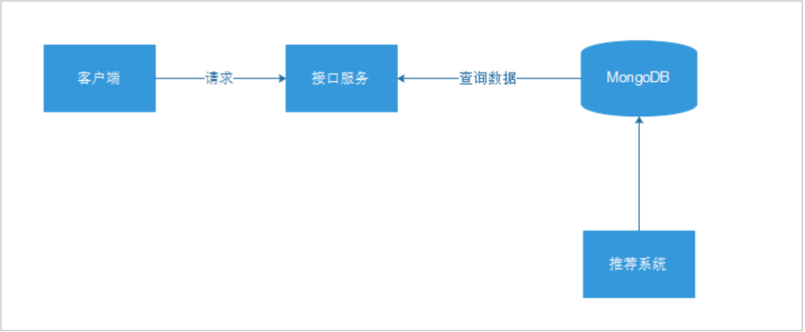

___

##### 2.3.4 实现分析：

当我们进入首页之后，上边会有一个滑动区域，有今日佳人，探花，公告等模块。我在这块负责今日佳人模块实现，主要根据用户的id查找对应的推荐佳人表，根据缘分值进行排序，获取第一个进行展示。缘分值是我们通过用户平时浏览平台动态和浏览小视频，对浏览的内容进行点赞、评论的情况以及用户本身的学历、婚姻状态等信息进行计算的。我们会把计算的最终值存储到MongoDB中方便用户进行快速查询。当用户对圈子，视频的动态执行操作时，如：发布、浏览、点赞、喜欢等，平台就会通过RocketMQ给推荐系统发送消息。推荐系统接收消息，并且处理消息数据，处理之后将结果数据写入到MongoDB中，Spark系统拉取数据，然后进行推荐计算，计算之后的结果数据写入到Redis中，为每个用户都进行个性化推荐，如果有用户没有数据的，查询MongoDB中的默认数据。我们这块动态计分规则是：浏览 +1，点赞 +5，喜欢 +8，评论 + 10，文字长度：50以内1分，50~100之间2分，100以上3分。

 
      <br 

#### 2.4 公告

主要用于接收平台发布的一些消息和福利，比如：新增功能通知，活动通知，版本迭代通知。

 

##### 2.4.1 涉及的表：

Tb_nnouncement(公告表)

___

##### 2.4.2 实现分析：

这块我们主要做两个事情，一个是公告查询分页，一个是公告对象转换VO。分页的话我们这里使用的是MybatisPlus的分页功能，公告对象转化VO主要是为了解耦和不做代码污染，我们通过创建一个list的方式把公告对象遍历到我们创建的AnnouncementVO对象中，在这里我们要做一个时间的校验，如果创建时间不存在我们需要给他生成个时间在进行加入。

 
      <br 

#### 2.5 圈子

类似微信朋友圈，我们可以发布图片，文字；可以对圈子里边的内容进行点赞，评论，喜欢操作。和微信朋友圈不一样的功能是微信只能查看好友的圈子，但是我们这个平台圈子推荐的不仅仅是好友还有系统智能推荐用户点赞喜欢的好友。

##### 2.5.1 技术要点：

**MongoDB + Redis + MongoDB geo + rocketMQ + 华为云内容审核 + Spark + Mllib**

___

##### 2.5.2 涉及的表：

| quanzi_publish（发布表）              |
| ------------------------------------- |
| quanzi_album_{userId}（相册表）       |
| quanzi_time_line_{userId}（时间线表） |
| quanzi_comment（评论表）              |
| tanhua_users（好友表）                |
| tb_user（用户表）                     |

___

##### 2.5.3 实现分析：

###### **2.6.3.1 通过页面分析，剖析如下：**

1、推荐频道为根据问卷及喜好推荐相似用户动态(**RocketMQ+Spark + MLlib**)

2、显示内容为用户头像、用户昵称、用户性别、用户年龄、用户标签和用户发布动态

3、图片最多不超过6张或发布一个小视频(**FastDFS**)

4、动态下方显示发布时间距离当时时间，例如10分钟前、3小时前、2天前，显示时间进行取整。(**MongoDB Geo**)

5、动态下方显示距离为发布动态地与本地距离

6、显示用户浏览量

7、显示点赞数、评论数 转发数

 

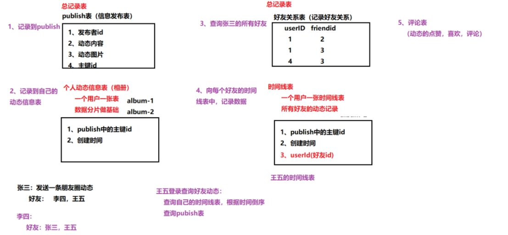 

 

###### **2.6.3.2 发布流程：**

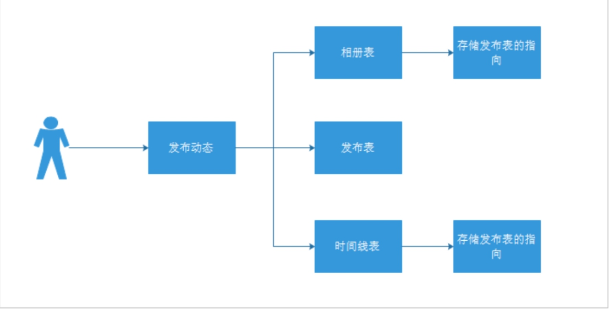 

\- 用户发布动态，首先将动态内容写入到发布表。

\- 然后，将发布的指向写入到自己的相册表中。

\- 最后，将发布的指向写入到好友的时间线中。

###### **2.6.3.3 查看流程：**

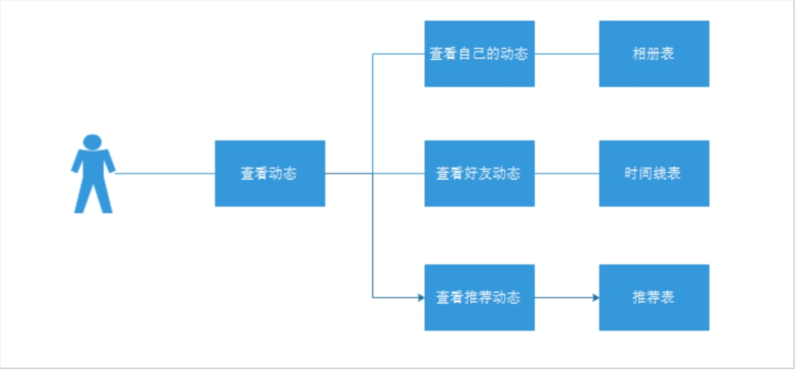 

\- 用户查看动态，如果查看自己的动态，直接查询相册表即可

\- 如果查看好友动态，查询时间线表即可

\- 如果查看推荐动态，查看推荐表即可

由此可见，查看动态的成本较低，可以快速的查询到动态数据。

###### **2.6.3.4 实现话术：**

我负责项目中的圈子功能的实现，类似微信的朋友圈，基本的功能为：发布动态、浏览好友动态、浏览推荐动态、点赞、评论、喜欢等功能。我们这里采用spark + mllib实现智能推荐，这样的话就会根据我们自身的条件，喜好进行匹配推送用户感兴趣的动态。针对用户上传的动态我们采用rocketMQ发送消息调用华为云内容审核进行自动处理，考虑到需要处理海量的动态信息数据，我们这里选用了MongoDB+Redis的形式来进行数据的存储，其中MongoDB负责存储，Redis负责缓存。

首先是查询好友动态接口的实现，用户点击好友动态之后，服务器会从ThreadLocal中获取用户id，根据用户id从该用户对应的好友动态时间线表中查询出所有好友动态id以及对应的好友id，再根据动态id从总动态表查询动态详细信息，根据动态发布的时间倒序排序。再根据好友id从用户详情表中查询好友用户详细信息，再将这些信息构造成vo对象返回给前端进行分页展示。

接下来说一下用户发布动态接口的实现，用户在客户端写好文本，上传好图片，确定好位置点击发布按钮之后，请求会携带一系列参数，文本内容，图片文件，地理位置的经纬度等，后端代码先创建对象，设置相应的属性，保存到MongoDB动态表中，此时动态的状态属性默认设置为0，表示待审核。然后通过rocketMQ向消息中间件发送一条消息，包含动态id，消息消费者接收到消息之后会调用华为云的内容审核服务，对文字信息和图片信息进行审核，审核通过后将动态的状态属性改为1，表示已通过，不然就改为2，表示驳回。然后前端在展示动态的时候只会查询状态为已通过的动态。动态发布成功之后也会像消息中间件发送消息，消息内容包括动态id（objectId类型）、用户id、操作类型、Long类型的pid。消息消费者会以此生成一条该用户对该动态的一个评分记录保存到MongoDB的动态评分表中，作为大数据推荐的依据。

然后说一下用户对动态的一系列操作的接口的实现。我们是将用户的点赞、评论、喜欢操作记录到MongoDB的一个comment表中，用type字段来区分具体的操作类型，比如1代表点赞，2代表评论，3代表喜欢。用户进行操作之后服务器就会生成相应操作类型的comment记录保存到MongoDB的comment表中。保存成功后向消息中间件发送消息，消息内容包括动态id（objectId类型）、用户id、操作类型、Long类型的pid。消息消费者会以此生成一条该用户对该动态的一个评分记录保存到MongoDB的动态评分表中，作为大数据推荐的依据。

最后是推荐频道的动态展示接口的实现，服务器使用Spark + Mllib技术，根据用户的动态评分表，基于用户userCF算法进行推荐，将推荐的结果以pid组成的字符串形式存入Redis。用户进入推荐频道之后，服务器去查找Redis有没有推荐结果，如果没有的话，就从MongoDB中查询默认的推荐动态数据展示，如果有推荐结果，就获取字符串，转换成pid的数组，再根据这些pid从MongoDB的总动态表中查找对应动态信息，构造vo对象的分页结果，返回给前端展示给用户。

 
      <br 

#### 2.6 小视频

用户可以上传小视频，也可以查看小视频列表，并且可以对推荐的视频进行点赞操作。通过页面分析我们需要获取视频展示出来的视频封页，好友的头像，昵称，点赞数量。

 

 

##### **2.6.1 技术要点：**

**FastDFS + CDN**

##### **2.6.2 涉及的表：**

| video(小视频表)          |
| ------------------------ |
| quanzi_comment（评论表） |
| quanzi_publish（发布表） |
| tb_user（用户表）        |

##### **2.6.3 实现分析：**

小视频功能类似于抖音、快手小视频的应用，用户可以上传小视频进行分享，也可以浏览查看别人分享的视频，并且可以对视频评论和点赞操作。对于存储而言，小视频的存储量以及容量都是非常巨大的，所以我们选择自己搭建分布式存储系统 FastDFS进行存储。对于推荐算法，我们将采用多种权重的计算方式进行计算，对于加载速度，除了提升服务器带宽外可以通过CDN的方式进行加速。发布视频的流程是：客户通过点击发布视频，会向后台传递3个数据，一个是视频封面图片，一个是视频，一个是文字。我们在后台会把视频封面图片保存到阿里的OSS图片存储服务器上会给我们返回一个图片的存储链接，把视频上传到本地部署的FastDFS上边会给我们返回一个视频的存储链接，之后我们这边构造一个Video对象，把需要的参数(文字，图片URL，视频URL，用户ID)通过调用VideoAPI进行保存到MongoDB中，之后构造返回值给用户进行显示发布成功。接下来用户会跳转到小视频列表页面。分页查询视频列表是根据后台推荐系统进行智能推荐的，这个根据用户浏览视频的时候点赞，喜欢，评论的情况进行分数积累，把对应的分数值存储到推荐表中，当用户下拉刷新的时候，会从MongoDB中查询出推荐的视频。

 
      <br 

#### 2.7 探花

左划喜欢，右划不喜欢，每天限量不超过50个，开通会员可增加限额。双方互相喜欢则配对成功，可以互加好友。

通过页面分析：我们需要展示用户的信息，包括：头像，昵称，年龄，是否单身，学历等。

实现：数据来源推荐系统计算后的结果。

 

 

##### **2.7.1 技术要点：**

**MongoDB + OSS + spark + 环信**

##### **2.7.2 涉及的表：**

| recommend_quanzi（推荐表） |      |
| -------------------------- | ---- |
| tanhua_users（好友表）     |      |
| tb_user（用户表）          |      |

 

##### **2.7.3 实现分析：**

当用户的通过点击探花进入时，会根据用户的id去MongoDB中查询10条推荐的好友信息，推荐依据是来源于推荐系统通过spak + Mallib 根据用户平时喜欢，点赞，评论进行生成。当用户选择喜欢的时候我们会把用户和喜欢好友的id写入到环信通讯中，再重新存入到MongoDB中，方便用户做选择。当用户选择不喜欢时候，我们要清除当前数据，不予以推荐。我们这块实现主要做了三个接口，分别是展示卡片列表接口，右滑喜欢接口，左滑不喜欢接口。展示列表我们根据获取的用户id去推荐表中查询默认的推荐好友。如果选择不喜欢会根据当前用户的id和推荐人的id调用接口将该用户的从推荐表中删除，如果选择喜欢，会根据当前用户的id和推荐人的id通过调用之前的一个喜欢接口生成一个实例保存到mongoDB数据库中，并且判断所喜欢的用户是否为自己的粉丝，如果是的话则将两人添加到好友关系表中，并且将环信中的两人绑定为好友关系，这样在好友列表中可以查询到对方并且可以进行聊天了。

 
 
      <br 

#### 2.8 测试灵魂

测灵魂是我们项目的一大亮点。平台会提供对应的初级灵魂，中级灵魂，高级灵魂对应的答卷。通过用户答题，我们会在后台进行用户行为数据分析，给用户发送一份信息报告，同时也会推荐和用户本人灵魂属性相符的人。我们这块会为每个灵魂等级设置10个问题，测试题为顺序回答，回答出初级题，我们才可以点击中级灵魂测试。

 

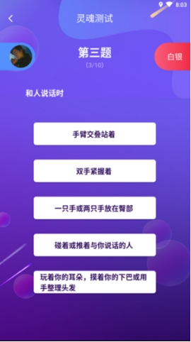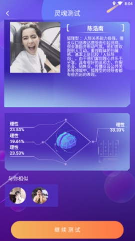    

##### **2.8.1 技术要点：**

MySQL + MongoDB

##### **2.8.2 涉及的表：**

tb_questionnaire(调查问卷)

tb_test_question(问卷问题)

tb_option(问题选项)

tb_conclusion(性格信息)                        **Mysql中的表**

testSoul_Questionnaire (调查问卷)                  **MongoDB中的表**

testsoul_user_score(用户得分)

testsoul_report

##### **2.8.3 实现分析：**

灵魂测试是通过用户答题的方式来进行分类，寻找同一类型或者内心深处的朋友。我们这块主要采用的技术有：MongoDB +Sprak+Mllib 当用户点击灵魂测试，我们会去后台加载用户的灵魂信息。如果是新用户我们会停留在初级灵魂题，后边的中级灵魂，高级灵魂则需解锁上一级才能进行答题。如果是老用户我们会加载用户之前测试灵魂的结果进行展示。如果之前他测评通过的是高级灵魂，那么就可以查看初级，中级，高级灵魂的测评。每一级的测评灵魂题都会有10道题，测评结束之后会根据用户的回答生成一个测试报告，通过点击我们可以查看属于自己的唯一一份灵魂报告。生成的报告主要根据用户的属性外向，判断，抽象，理性组成。我们可以把自己的报告进行分享或者选择重做。当进行报告查看时候我们还可以查看系统给我推荐的测试结果相同的好友。通过点击好友头像，我们可以通过回答陌生人问题来进行确认好友，如果对方回复并通过就可以进行正常的交友啦。

 
      <br 

#### 2.9 桃花传音

 

 

##### **2.9.1 技术要点：**

**MongoDB + FastDFS + Quartz**

##### **2.9.2 涉及的表：**

| user_sound（用户语音）         |      |
| ------------------------------ | ---- |
| user_soundTime（语音剩余次数） |      |
| tb_user（用户表）              |      |

##### **2.9.3 实现分析：**

语音匹配类似漂流瓶类似，可以发送匿名语音，可以收听匿名语音。收听完匿名语音可以选择喜欢或不喜欢。如果双方互相喜欢那么可以配对成功互相关注，一个人每天只能接收8次，自己接收过语音，其他人不能再使用。如果双方都点击喜欢，就可以添加为好友。这块我们采用的是MongoDB做数据存储，使用Dubbo做分布式服务的调用，使用FastDFS存储语音。用户可以发布一段语音文件，上传到fastDFS中，并且将返回的地址值，与当前用户的一些信息封装成实例保存到mongoDB中，其他用户会进行接收操作时，随机在数据库中获取一条语音信息，然后进行选择打招呼，和扔掉，打招呼的话就可以进行调用环信的发送一条信息，如果对方回复的话则成为好友，同时该语音文件会在数据库中删除，如果扔掉的话则不会再数据库中消失，继续等待被获取。

