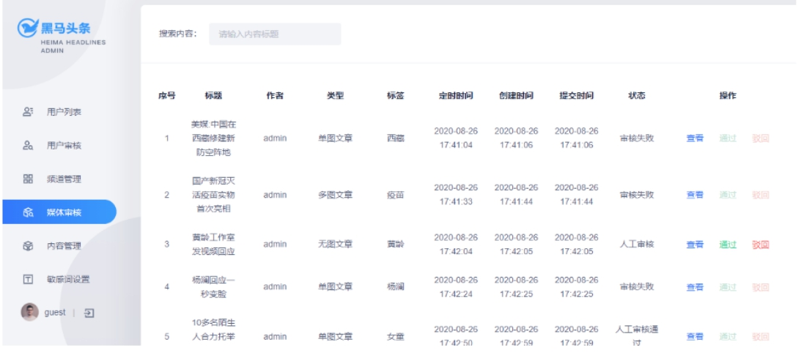

# 黑马头条

## 一、项目介绍

### 1.1项目背景

 随着智能手机的普及，人们更加习惯于通过手机来看新闻。由于生活节奏的加快，很多人只能利用碎片时间来获取信息，因此，对于移动资讯客户端的需求也越来越高。黑马头条项目正是在这样背景下开发出来。黑马头条项目采用当下火热的微服务+大数据技术架构实现。本项目主要着手于获取最新最热新闻资讯，通过大数据分析用户喜好精确推送咨询新闻。

 
   

#### 1.2 项目概述

黑马头条项目是对在线教育平台业务进行大数据统计分析的系统。碎片化、切换频繁、社交化和个性化现如今成为人们阅读行为的标签。黑马头条对海量信息进行搜集，通过系统计算分类，分析用户的兴趣进行推送从而满足用户的需求。

 

 
   

#### 1.3 需求说明

 
   

#### 1.4 功能架构图

 

 
   

#### 1.5 APP主要功能大纲

· 频道栏：用户可以通过此功能添加自己感兴趣的频道，在添加标签时，系统可依据用户喜好进行推荐

· 文章列表：需要显示文章标题、文章图片、评论数等信息，且需要监控文章是否在APP端展现的行为

· 搜索文章：联想用户想搜索的内容，并记录用户的历史搜索信息

· 查看文章：用户点击文章进入查看文章页面，在此页面上可进行点赞、评论、不喜欢、分享等操作；除此之外还需要收集用户查看文章的时间，是否看我等行为信息

· 注册登录：登录时，验证内容为手机号登录/注册，通过手机号验证码进行登录/注册，首次登录用户自动注册账号。

· 实名认证：用户可以进行身份证认证和实名认证，实名认证之后即可成为自媒体人，在平台上发布文章

· 个人中心：用户可以在其个人中心查看收藏、关注的人、以及系统设置等功能

 
   

#### 1.6 自媒体端功能大纲

· 内容管理：自媒体用户管理文章页面，可以根据条件进行筛选，文章包含草稿、已发布、未通过、已撤回状态。用户可以对文章进行修改，上/下架操作、查看文章状态等操作

· 评论管理：管理文章评论页面，显示用户已发布的全部文章，可以查看文章总评论数和粉丝评论数，可以对文章进行关闭评论等操作

· 素材管理：管理自媒体文章发布的图片，便于用户发布带有多张图片的文章

· 图文数据：自媒体人发布文章的数据：阅读数、评论数、收藏量、转发量，用户可以查看对应文章的阅读数据

· 粉丝画像：内容包括：粉丝性别分布、粉丝年龄分布、粉丝终端分布、粉丝喜欢分类分布

 
   

#### 1.7 平台管理端功能大纲

· 用户管理：系统后台用来维护用户信息，可以对用户进行增删改查操作，对于违规用户可以进行冻结操

· 用户审核：管理员审核用户信息页面，用户审核分为身份审核和实名审核，身份审核是对用户的身份信息进行审核，包括但不限于工作信息、资质信息、经历信息等；实名认证是对用户实名身份进行认证

· 内容管理：管理员查询现有文章，并对文章进行新增、删除、修改、置顶等操作

· 内容审核：管理员审核自媒体人发布的内容，包括但不限于文章文字、图片、敏感信息等

· 频道管理：管理频道分类界面，可以新增频道，查看频道，新增或修改频道关联的标签

· 网站统计：统计内容包括：日活用户、访问量、新增用户、访问量趋势、热门搜索、用户地区分布等数据

· 内容统计：统计内容包括：文章采集量、发布量、阅读量、阅读时间、评论量、转发量、图片量等数据

· 权限管理：超级管理员对后台管理员账号进行新增或删除角色操作

 
   

#### 1.8 其它需求

 

 
   

#### 1.9 交互需求

 

 
      <br 

## 二．功能介绍

随着 Restful API、微服务的兴起，基于 Token 的认证现在已经越来越普遍。基于token的用户认证是一种**服务端无状态**的认证方式，所谓服务端无状态指的token本身包含登录用户所有的相关数据，而客户端在认证后的每次请求都会携带token，因此服务器端无需存放token数据。

当用户认证后，服务端生成一个token发给客户端，客户端可以放到 cookie 或 localStorage 等存储中，每次请求时带上 token，服务端收到token通过验证后即可确认用户身份。

 

### 2.1 admin端-登录实现

根据用户名和密码登录，验证用户名和密码不能为空。首先查询该用户是否存在。根据名称查询，判断，如果用户是空，数据不存在。然后进行密码比对，与数据库里的信息比，如果不一致，返回密码错误，如果密码正确，返回token，并且返回部分用户信息（隐藏敏感信息）给前端。

 
     

### 2.2 app端

#### 2.2.1 APP端用户认证

**全局过滤器实现jwt校验**

 

通过网关进行授权验证

首先判断地址中是否包含登录的地址，如果是登陆的地址，不需要token,直接放行，如果不是登陆地址，需要验证token。先获取token（获取请求头对象），判断token是否为空，如果为空返回401，结束请求，不为空需要验证token，验证通过，需要将用户ID放入到请求头中，供后面的微服务使用。

#### 2.2.2 App端用户认证审核

流程说明

用户审核功能

根据ID查询用户，判断审核状态，如果是审核失败，修改用户状态，并且添加失败的原因，并保存并更新后的数据。审核通过，需要创建自媒体用户，构建自媒体用户，通过Feign远程调用接口，判断结果。如果创建自媒体用户成功，那么则继续创建作者，如果作者不为空，需要将authorId更新到自媒体账号中，修改apUserRealname状态，修改apUser中的flag，构建作者信息，通过Feign远程调用接口，判断结果。

#### 2.2.3 登录功能

**app端登录-需求分析**

· 点击**登录**可以根据app端的手机号和密码进行登录

· 点击**不登录**，先看看可以在无登录状态下进入app

app端登录-思路分析

概念介绍：**用户设备**，即当前用户所使用的终端设备。

1，用户点击**登录**

· 用户输入手机号和密码到后端进行校验，校验成功生成token返给前端

· 其他请求需要带着token到app网关去校验jwt,校验成功，放行

2，用户点击**不登录，先看看**

· 获取用户的设备id到后端根据设备id生成token,设置jwt存储的id为0

· 其他请求需要带着token到app网关去校验jwt,校验成功，放行

 

用户登陆，查询用户，判断用户的密码是否与传递进来的密码一致，判断用户的密码是否与传递进来的密码一致，密码一致生成token，发送token给前端。

#### 2.2.4 关注作者或取消关注

如上效果：

当前登录后的用户可以关注作者，也可以取消关注作者

**思路分析**

一个用户关注了作者，作者是由用户实名认证以后开通的作者权限，才有了作者信息，作者肯定是app中的一个用户。

从用户的角度出发：一个用户可以关注其他多个作者

从作者的角度出发：一个用户（同是作者）也可以拥有很多个粉丝(用户)

实现步骤：

1 前端传递作者id获取作者信息，最终获取到作者在当前app端的账号id

2 如果是关注操作，需要保存数据，用户保存关注的作者，作者保存当前的粉丝

2.1 异步记录关注行为（后面开发，为了推荐做准备）

3 如果是取消关注，删除用户关注的作者，删除作者当前的粉丝

 

app端关注信息表

记录了当前登录用户和关注人（作者）的关系，方便当前用户查看关注的作者

· app端用户粉丝表

· 记录了作者与粉丝的关系，方便作者查看自己的粉丝，同时当前作者也是app中的一个用户

 

app用户表与app作者表是一对一关系，只有在用户认证以后才会有作者出现

· app用户表与app用户关注表是一对多的关系，一个用户可以关注多个作者

· app用户表与app用户粉丝表是一对多的关系，一个用户可以拥有多个粉丝

· 

· 实现分析

· 判断当前用户是否是正常登陆(不是设备ID)，发送消息，行为处理都是可以记录的，有登录用户,设置登录用户的ID，根据authorId获取userId，获取关注的历史记录，查询该用户对应作者的粉丝信息，判断操作类型，0关注，1取消。

 

#### 2.2.5 用户行为处理

用户操作行为记录-点赞行为

需求分析

 

当前登录的用户点击了”赞“,就要保存当前行为数据

**涉及到的表**

 

**实现分析**

调用微服务查询当前用户点赞记录，更新点赞量时需要判断当前用户是否已经对这篇文章有过点赞数据,没有点赞记录，则更新文章库中文章表的点赞数,行为库中添加点赞记录，如果有点赞记录，不再新增，但是可以修改（取消点赞），获取当前的点赞状态，判断点赞记录的类型与当前是否一致，不一致且操作为取消点赞，如果点赞记录为空,保存点赞记录，取消点赞更新文章表中点赞数,更新行为库记录。

 

#### 2.2.6 评论系统

文章详情页下方可以查看评论信息，按照点赞数量倒序排列，展示**评论内容、评论的作者、点赞数、回复数、时间**，默认查看20条评论，如果想查看更多，可以点击加载更多进行分页

**评论概述：**

登录用户可以进行评论，可以针对当前文章发布评论。

评论内容不为空且不超过140字，评论内容需要做文本反垃圾检测，评论内容需要做敏感词过滤，用户登录后才可以对文章发表评论。

**评论话术：**

每次用户要评论时，都会进行过滤，通过滤类，确保用户登陆后才能进行评论。

然后识别评论内容，字数判断，140字以内。文本反垃圾检测、阿里云安全审核敏感词。

都通过后，保存用户评论，正式发布评论。

**点赞话术：**

同样通过过滤器，保证用户登录后才可以对评论点赞。

根据当前用户id和评论id查询是否已有点赞记录，如果已有显示为已点赞。

如果没有点赞记录,新增点赞记录,更新评论的点赞数+1

已有点赞记录,判断点赞记录中的点赞状态是否与当前操作一致

不一致进行点赞数更新和点赞记录更新点赞操作,

根据点赞或取消点赞，评论数进行加减1

 

**评论列表话术：**

根据文章id查询评论列表，按照点赞的数量进行排序。

如果用户已经登录，需要判断当前登录用户，对评论列表中的哪些评论已点赞。

评论列表会进行分页查询。

 

**回复话术：**

回复功能包括，回复评论、回复列表展示、回复点赞。

当用户点击了评论中的回复时就可以查看所有评论回复的内容。

当用户针对当前评论回复时，需要更新回复数量。

当用户对回复点赞时，保存当前回复的点赞信息。

 

#### 2.2.7 文章搜索

**文章搜索话术：**

在APP端正上方有搜索框，可以输入搜索的关键字。

根据用户输入的关键字通过es分词查找文章列表。

文章列表的展示和home页展示一样，当用户点击某一篇文章时，可查看详情。

从es的查询效率远比直接查数据库要快。所以需要把文章相关的数据存储到es中。

搜索时查询es、展示列表，记录当前用户的搜索历史。

查询结果按照发布时间倒序排列。

 

**搜索记录话术：**

搜索历史记录会保存之前的5调搜索关键词。用户可以选择手动删除。

在搜索时，会把搜索记录进行保存，存储的是用户实体信息和搜索关键词记录。

在用户再次点击到搜索框时，会查询当前用户的搜索记录列表，展示给用户。

当用户删除记录时，会将状态修改为0，让历史记录无效，便不会展示。

 

**关键词联想：**

根据用户输入的关键字进行联想，默认展示5条联想词。

将用户搜索记录经过数据清洗后保存到联想词表,这是一个动态的数据，定时每天抓取搜索较高的1万条数据放到这里,之后根据关键字进行查询

由于每次用户输入都会访问数据库，所以使用redis缓存进行缓解压力。

讲清晰的词分成词组，根据用户输入的在redis中查询出5条，并展示。

数据结构为Trie树

 
 
      

### 2.3 自媒体文章

#### 2.3.1 自媒体文章列表查询

**业务/需求:**

 

​	所属：内容列表

​	分页：需要进行分页

​	条件：文章状态、关键字、频道列表、发布日期

​	可以通过左侧的 “内容列表” 进入 文章查询页面。

筛选条件有：

​	文章状态： 	全部、草稿、待审核、审核通过、审核失败

​	关键字：	用户输入

​	频道列表：	通过查询列表并展示

​	发布日期：	可选择区间

​	默认查询当前用户的文章，状态：全部，不带有其他筛选信息，分页展示文章列表。

​		

**话术：**

​	1.从本地线程获取到当前用户的id，如果id为null则用户未登录，给出”请登录”提示。

​	确保登陆后，通过用户id查询出，用户的文章列表。

​	2.其他相关条件查询时，都会先判断是否为空，

确保用户有输入或选择后再加入对应的查询条件。

​	条件包含:

​		关键字、所属频道ID、文章状态、发布时间的开始和结束

​		其中所属频道ID在 ad_channel表中，因为该表id从1开始递增。

如果id值大于0，会根据所属id进行查询，

（频道ID从ad_channel表中查询出所有频道加载到页面即可）

​	3.对查询的结果进行排序，我们选择根据发布时间倒叙排列。根据实际业务需求可选创建时间、发布时间等进行排序

​	4.封装好后将其返回，完成文章查询功能。

​	 

#### 2.3.2 自媒体文章的发布、修改、保存功能

**业务/需求：**

 

文章包含：

​	标题：

​	内容：

​	

​	文字内容：点击后可以手动输入需要添加的内容。可以多条。

​	

图片内容：可以从素材库选择或本地上传，可以上传多个图片。

​	

​	标签：用户自定义标签

​	频道：可以从列表中选择

​	定时：设置发布时间，到时间自动发布

 

​	封面图片：无图、一张图、三张图

​		跟前端布局有关。一般都是以上三种图片布局

​	

**话术：**

​	该功能为保存、修改、保存草稿的共有方法，

​	其中需要注意的是 

**修改：**如果有那么是修改文章，先删除所有素材关联关系，再继续操作。

点击修改按钮，携带文章id，进入编辑页面，可以修改文章的详细信息。

修改的详细信息，都在文章发布功能中实现，如果有ID为修改，无ID为新增。

 

​	封面图片：

如果选择是自动需要从内容中截取图片做为封面图片

截取规则为：内容图片的个数小于等于2 则为单图截图一张图，内容图片大于等于3，则为多图，截图三张图，内容中没有图片，则为无图

​	设置发布和创建时间，通过当前线程获取当前用户，未登录给出提示。

​	通过dto对象获取封面图片，并提取内容中的图片，返回一个图片地址url的List集合。

​	判断当前发布文章的封面类型 如果是-1为自动。

​	关于封面图片选择 “自动” 选项时，我们会提取内容中的图片。

​	通过判断type是image统计数量并获取其值。

​	内容中图片数量  0为无图。小于等于2 为1图  大于2 为3图。

​	超过3图会取前三个作为封面。

​	多张封面图片使用逗号分隔存入。

​	另外如果是保存草稿不需要添加素材和文章的关系。否则正常添加关系即可。

#### 2.3.3 自媒体文章的修改

**业务/需求：**

 

 

通过点击现有文章进入编辑页面。可以对现有文章进行编辑修改。

**话术：**

点击修改的时候，就是根据文章id查询，跳转至编辑页面进行展示。

这里只做一个页面跳转，具体修改功能的实现是由之前自媒体文章发布功能实现。

#### 2.3.4 自媒体文章的删除功能

**业务/需求：**

 

 

点击现有文章的删除按钮，可以删除文章。

想要删除时，需要几个前提条件

1. 文章id存在

2. 文章存在

3. 状态不是9

然后可以进行文章和素材关系的解除。之后再进行删除文章即可。

**话术：**

​	在做文章删除功能时，除了状态为9 已发布的文章不能删除外。

​	其他状态状态下都可以进行删除。

​	我们会先把文章和素材的关联关系删除掉，然后再进行对应文章的删除。

#### 2.3.5 自媒体文章的上下架功能

**业务/需求：**

 

对已发布的文章进行上下架操作

针对当前状态为9(已发布)的文章进行上下架操作，并把数据同步到文章库中。使用kafka实现

 

**话术：**

​	前台页面只有文章状态为9的会出现上下架选项，

​	先WmNewsdto对象保证不为空，并且id不为空。然后获取文章

​	确保文章存在，并且状态为9 已发布时，就可以进行上下架操作了。

​	我们只需要把enable修改一下即可。然后通过Kafka同步到App端

直接发送一个包含上下架信息的主题（Topic），存的是map转换后的json包含enable（上下架状态），和articleId(发布文章库ID)。

#### 2.3.6 自媒体文章审核

**1.自媒体文章审核的流程**

**业务/需求：**

​	自媒体文章可以自由发布，所以文章的内容是否符合规范、安全非常重要。所以我们要细化内容审核的流程，来把控发布的文章。

文章审核分为 人工审核 和 自动审核。

**人工审核：**

状态为4的进行人工审核。我们只需要把文章分配给审核工作人员即可。

​	如果人工审核的文章发布时间大于当前时间，即可直接修改状态为8 审核通过(待发布)

​	否则保存文章相关数据。

**自动审核：**

状态为1的需要进行自动审核。

我们会调用阿里云文本反垃圾服务，进行文章自动审核。

​	如果审核不成功或需要人工审核，修改文章状态。

​	如果当前文章有图片，调用阿里云图片审核服务，同样如果不成功，需要修改文章状态。

​	自动审核通过

​	如果文章发布时间大于当前时间，修改自媒体文章状态为8 审核通过(待发布)

​	否则保存文章相关数据

​	

**2.文章审核**

**业务/需求：**

自媒体和文章我们使用 Spring-Cloud的feign进行远程接口调用。

**自媒体feign**

1 根据文章id查询自媒体文章的数据

2 在审核的过程中,审核失败或者成功需要修改自媒体文章的状态

3 在文章进行保存的时候需要查询作者信息，需要通过自媒体用户关联查询作者信息

**文章feign**

1 保存文章信息 ap_article

2 保存文章内容 ap_article_content

3 在保存文章的时候需要关联作者，需要根据名称查询作者信息

 

考虑到发表的文章会随时间增加，数据量巨大。所以使用分布式id，分库进行保存。

所以我们选择使用 雪花算法生成数据库id，Mybaits逆向工程使用ASSIGN_ID生成。

**雪花算法：**

snowflake是Twitter开源的分布式ID生成算法，结果是一个long型的ID。其核心思想是：使用41bit作为毫秒数，10bit作为机器的ID（5个bit是数据中心，5个bit的机器ID），12bit作为毫秒内的流水号（意味着每个节点在每毫秒可以产生 4096 个 ID），最后还有一个符号位，永远是0

 

**话术：**

**文章审核：**

我们的文章审核功能围绕着状态来实现。首先我们发布的文章初始状态肯定是1(待审核)，所以我们会根据文章***\*状态\****进行如下操作：

​	状态1	

进行自动审核，通过阿里云安全的内容文本检测、图片审核，

DFA敏感词过滤来完成审核。

文本审核结果会有1 审核通过  2 审核失败  3需要人工审核。

​			自动审核通过后，根据当前时间是否大于发布时间进行判断

是：直接保存到文章库

否：修改状态为8审核通过(待发布)

先保存数据，等发布时间到了再进行发布。 

​	状态8和状态4

​		8和4为人工审核通过或自动审核通待发布的文章，

所以只需要判断当前时间是否大于发布时间。

是：直接保存到文章库

否：先保存数据，等发布时间到了再进行发布。

#### 2.3.7 自媒体文章自动审核流程

作为内容类产品，内容安全非常重要，所以需要进行对自媒体用户发布的文章进行审核以后才能到app端展示给用户。

审核的流程如下：

1.当自媒体用户提交发布文章之后，会发消息给kafka提交审核，平台运营端监听消息

2.根据自媒体文章id查询文章信息

3.如果当前文章的状态为4（人工审核通过），则无需再进行自动审核，如果发布时间大于当前时间,将状态修改为8,否则保存APP文章相关数据

4.文章状态为8,发布时间小于等于当前时间,则直接保存app文章相关数据

5.文章状态为1，则进行自动审核

5.1 调用阿里云文本反垃圾服务，进行文本审核，如果审核不成功或需要人工审核，修改自媒体文章状态

5.2 如果文章中有图片,调用阿里云图片审核服务，如果审核不通过或需要人工审核，修改自媒体文章状态

5.3 文章内容中是否有自管理的敏感词，如果有则审核不通过，修改自媒体文章状态

5.4 自动审核通过,如果文章发布时间大于当前时间，修改自媒体文章状态为8（审核通过待发布状态）

5.5 自动审核通过,如果文章发布时间小于等于当前时间，保存app相关数据

6.保存app相关数据,修改自媒体文章状态为 9 （已发布）

ap_article 文章

ap_article_content 文章内容

ap_author 文章作者

7.创建索引（为后续app端的搜索功能做数据准备）

**表结构**

（1） wm_news 自媒体文章表 在自媒体库、

status字段：0 草稿  1 待审核  2 审核失败  3 人工审核  4 人工审核通过  8 审核通过（待发布） 9 已发布

（2）ap_author 文章作者表 在article库

 

（3）ap_article 文章信息表 在article库

 

· layout 文章布局 0 无图文章 1 单图文章 2 多图文章

· flag 文章标记 0 普通文章 1 热点文章 2 置顶文章 3 精品文章 4 大V 文章

· images 文章图片 多张图片使用逗号分隔

（4）ap_article_content 文章内容表 在article库

 

**自媒体文章审核实现**

当自媒体用户提交发布文章之后，会发消息给kafka提交审核，平台运营端监听消息，根据自媒体文章id查询文章信息，判断当前文章的状态，丛自媒体文章中提取文本和图片内容，调用阿里云文本反垃圾服务，进行文本审核，如果审核不成功或需要人工审核，修改自媒体文章，调用阿里云图片审核服务，如果审核不通过或需要人工审核，修改自媒体文章状态，文章内容中是否有自管理的敏感词，如果有则审核不通过，修改自媒体文章状态，自媒体文章发布时间大于当前时间，修改自媒体文章状态为8（审核通过待发布状态），审核通过，修改自媒体文章状态为 9 （审核通过），保存app相关数据，如果当前文章的状态为4（人工审核通过），则无需再进行自动审核审核，保存app文章相关数据即可，文章状态为8,发布时间<=当前时间,则修改发布状态，文章状态为1，则进行自动审核，

#### 2.3.8 定时任务扫描待发布文章

**业务/需求:**

​	定时任务的作用就是每分钟去扫描那些待发布的文章，如果当前文章的状态为8，并且发布时间小于当前时间的，立刻发布当前文章

流程：

1. 文章数据准备，远程调用接口自媒体端文章查询功能，得到状态为8且发布时间小于当前时间的文章。

2. 在任务调度中心创建调度任务，新建一个执行器，策略为轮询，每分钟执行一次。

3. 将扫描到符合条件的文章进行发布。

话术：

通过自媒体短的文章查询准备好数据后，我在项目中引入了xxl-job调度任务中心，定义一个自媒体文章审核的执行器，路由策略采用轮询，每分钟执行一次扫描，如果发现有当前文章的状态为8，并且发布时间小于当前时间的，立刻发布当前文章。

#### 2.3.8 人工审核文章-admin端

**业务/需求:**

 

​	前提：自动审核失败，状态为3的。

自动审核使用的是阿里云和DFA。某些情况自动审核会不通过，比如一些无法识别、无法分辨的信息等。会把文章从自动审核转到人工审核状态，并添加到人工审核列表。审核人员可以从列表中看到需要进行人工审核的文章，并且进行审核后选择 通过或不通过。	

平台管理员可以查看待人工审核的文章信息，可以通过（状态改为4）或驳回（状态改为2）也可以通过点击查看按钮，查看文章详细信息，查看详情后可以根据内容判断是否需要通过审核

 

**话术：**

我们在人工审核这里主要考虑的是列表的展示、并且增加一些搜索功能，方便找到对应的文章。可以根据文章ID查看文章详情。对详情内容进行详细过审后，可以根据人工结果选择操作通过或不通过。

当审核通过后修改文章状态为4，如果审核不通过 修改状态为2，并添加审核不通过原因。

#### 2.3.9 自媒体登陆

通过网关进行授权验证

首先判断地址中是否包含登录的地址，如果是登陆的地址，不需要token,直接放行，如果不是登陆地址，需要验证token。先获取token（获取请求头对象），判断token是否为空，如果为空返回401，结束请求，不为空需要验证token，验证通过，需要将用户ID放入到请求头中，供后面的微服务使用。

 
 
      

#### 2.4 新热文章计算

**业务/需求:**

筛选出文章列表中最近5天热度较高的文章在每个频道的首页展示

根据用户的行为（阅读、点赞、评论、收藏）实时计算热点文章

**话术:**

新热文章计算分为三个部分

 1.我们会定时计算热点文章，设置定时任务每日凌晨1点开始，查询前5天的文章。

计算每个文章的分值，其中不同的行为设置不同的权重（阅读：1，点赞：3，评论：5，收藏：8）

按照分值排序，给每个频道找出分值较高的30条数据，存入缓存中

 2.实时计算热点文章

\- 行为微服务，用户阅读或点赞了某一篇文章，发送消息给kafka

\- 文章微服务，接收行为消息，使用kafkastream流式处理进行聚合，发消息给kafka

\- 文章微服务，接收聚合之后的消息，计算文章分值（当日分值计算方式，在原有权重的基础上再*3）

\- 根据当前文章的频道id查询缓存中的数据

\- 当前文章分值与缓存中的数据比较，如果当前分值大于某一条缓存中的数据，则直接替换

\- 新数据重新设置到缓存中

3. 查询热点数据

\- 判断是否是首页

\- 是首页，选择是推荐，channelId值为`0`，从所有缓存中筛选出分值最高的30条数据返回

\- 是首页，选择是具体的频道，channelId是具体的数字，从缓存中获取对应的频道中的数据返回

\- 不是，则查询数据库中的数据

 

